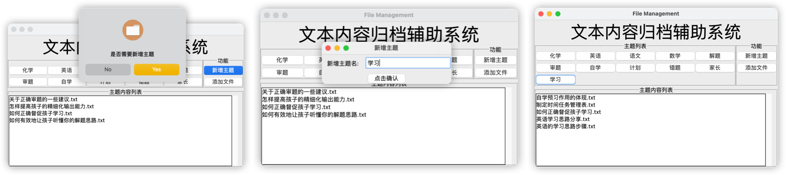

  
  <h1 style="text-align: center;">Word Wise</h1>

A file manager that organizes text files by keyword-based topics.

1. When the program opens, it will automatically archive all files in the file folder where the files are saved.
2. When the user clicks the add theme button, a pop-up window will pop up automatically to remind the user to enter. If
   the theme entered by the user already exists, the addition will fail.
3. If the theme is added successfully, the theme will be automatically analyzed, and the existing files will be matched
   and archived.
4. When you click the Add File button, the window for selecting a file will pop up. When a file is selected, the file
   will be automatically copied to the file folder and word segmentation will be performed to match all current topics
   for archiving.

# Main Features

- Making interactive interface with Tkinter.
- The interface is composed of button, listbox, labelframe and label.
- Use Jieba to segment the subject and text, and loop matching.

- [x] Use Tkinter to design GUI and reasonable window layout.
- [x] List all files under the currently selected topic directory in the list box.
- [x] Pop up the file selection window and copy the selected file to system folder.
- [x] The newly imported files can be automatically segmented.
- [x] Double click the file name to open the file in the system default mode.
- [x] Be able to customize the theme button and analyze the theme text.

# Design Scheme

> Module Diagram and Flow Chart

# Instructions

## Preparation

- Install the os, jieba, shutil, subprocess and tkinter modules.
- Run the main.py to start program.

## Add topic

Click Add topic to open the add topic window. After correct input, all the current corresponding files will be automatically archived.

## Add file

Click add file to pop up the select File pop-up window. After successful selection, the file classification will be automatically archived. Double click the file in the list box to open it by default.

